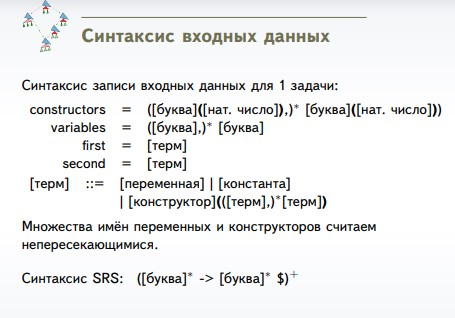

# Входные данные 

# Часть первая
Дана сигнатура для TRS. Написать алгоритм
унификации линейных термов в этой сигнатуре.

Тестирование первой версии
| Тесты      | Вывод программы         | 
| ------------- |:-------------:| 
|constructors	= g(1),A(0),f(2) variables= x,y,z,w,v first = f(w,g(A)) second= f(f(y,x), z)| z:=g(A), w:=f(y,x) f(f(y,x),g(A))| 
| constructors	= g(2),A(0),B(0) variables= x,y first 	= g(A,x) second	= g(y,B)      | y:=A, x:=B g(A,B) | 
| constructors	= g(1),A(0),f(2) variables= x,y,z,w,v first 	= f(g(A)) second	= f(f(y,x), z)    | Ошибка при обработке терма f(g(A)) на позиции 6. Неверное количество аргументов у f 
| constructors	= g(1),A(0),f(2) variables= x,y,z,w,v first = x second= A  | x:=A A   
| constructors	= g(1),A(0),B(0),f(2) variables= x,y,z,w,v first = B second= A    | Ошибка при унификации, конструкторы B и A разные.

Тесты второго этапа, на которых первая версия программы 
| Тесты      | Вывод программы         | 
| ------------- |:-------------:| 
|constructors	= g(1),A(0), f(2) variables= x,y,z, w,v first = f(w,g(A)) second= f(f(y,x), z)| Аварийное завершение программы| 

Не был реализован пропуск пробелов при парсинге списка конструкторов и переменных, после реализации которого программа работает корректно

# Часть вторая
Дана SRS. Написать алгоритм проверки ее
конфлюэнтности по перекрытию.

Тестирование первой версии
| Тесты      | Вывод программы         | 
| ------------- |:-------------:| 
| fgf -> ghhg hh →| Внутри терма fgf есть перекрытие.
| constructors	= g(2),A(0),B(0) variables= x,y first 	= g(A,x) second	= g(y,B)      | hhg и fgfh перекрываются
| constructors	= g(1),A(0),f(2) variables= x,y,z,w,v first 	= f(g(A)) second	= f(f(y,x), z)    | SRS конфлюэнтная
| [Очень длинный тест для проверки скорости работы](./tests/confluence_test4.txt) | tdxmwcuqhxwbuliqbcffeisxiwdqbuqixnpnlevvaobrhdteivamcdoalbtlxdbdjlaimiprftocetvlerlwgauscnqhqkcybmmj и symutonjxiigxgewgctvccwmobtcstvvocwqdmeimpmxgxvmdytqmuypwsotxnknurktfnkyjbqxvxoawaeglbwcxlhjlqyjmvet перекрываются
|  vcell -> sdajfksdjf auptap -> sdajfksdjf dbtgm -> sdajfksdjf owlpw -> sdajfksdjf sqspj -> sdajfksdjf aiemvb -> sdajfksdjf ipkwm -> sdajfksdjf nslvr -> sdajfksdjf owutu -> sdajfksdjf cekkw -> sdajfksdjf |SRS конфлюэнтная

Первая версия аварийно завершалась при наличии пустой строки в конце тестового файла, так как пустая строка не соответствовала формату строки в SRS, а проверки на пустоту не было. После добавления соответствующей проверки программа обрабатывала такие ситуации корректно.
