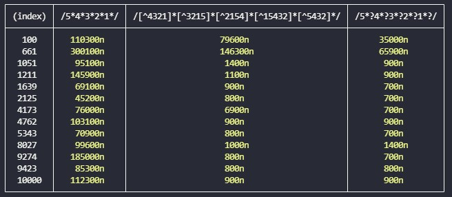
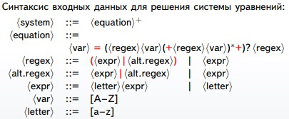
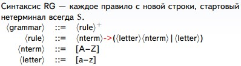

# Часть первая

*Написать три эквивалентных (описывающих один и тот же язык) регулярных выражения: академическое; с использованием отрицания; с использованием ленивой итерации Клини. Минимальная длина regex — 10 символов. Сравнить производительность этих regex на 10 тестах длиной от 100 до 10^5 символов.*

Возьмем алфавит [1-5]. И слова, в которых каждый следующий символ меньше или равен предыдущему. 

Академическое регулярное выражение: ``` 5*4*3*2*1* ```

Выражение с использованием отрицания: ``` [^4321]*[^3215]*[^2154]*[^15432]*[^5432]* ```

Выражение с использованием ленивой итерации Клини: ``` 5*?4*?3*?2*?1*? ```

Результаты:

 

Для меня стало неожиданностью, что с длинными строками академические регулярные выражения работают куда медленее остальных, поэтому график [result.png](./result.png) отображает, по сути, только его производительность. Но константы программы можно легко менять.

# Часть вторая
*Алгоритм решения системы регулярных выражений с беззвездными коэффициентами.*

 

Для решения системы уравнений нужно последовательно выразить каждую переменную через другие и подставить в каждое уравнение.

``` X = aX + bY + cZ + bc```

``` X = a*(bY|cZ|bc)```

Для примера подставим X в уравнение ```Y = cX + bY + aZ + aa```. Получим ```Y = ca*(bY|cZ|bc) + bY + aZ + aa``` или ```Y = (ca*b|b)Y + (ca*c|a)Z + (ca*bc|aa)```. Аналогично выражаем Y и подставляем в остальные уравнения.
В итоге получаются громоздкие регулярные выражения, я упрощаю их, начиная выражать переменные с коротких уравнений,
не добавляя лишние скобки при операциях * и |.
# Часть третья
*Преобразование Regular Grammar в Regex*



Регулярную грамматику можно представить в виде системы уравнений, для получения регулярного выражения необходимо найти стартовый нетерминал. 
Но при этом надо избавиться от нетерминалов-ловушек. Я запускала рекурсивную функцию от стартового нетерминала, которая определяла "хороший" ли нетерминал. 
Нетерминал A "хороший" если существует правило вида A -> b или A -> bB и нетерминал B "хороший".
