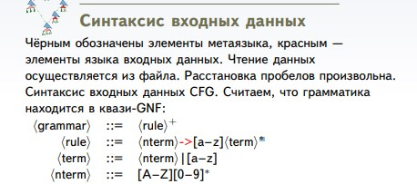

# Часть первая
*Найти синтаксическую структуру, которую нельзя распознать с помощью DPDA с допуском по пустому стеку и FA, но можно с помощью CFG.*

В js такой конструкцией является лямбда-функция, которая возвращает лямбда функцию. 
`a = (k) => () => (k*2)`

# Часть вторая
Путём анализа накачек грамматики провести частичный
анализ её регулярности. Результат
должен быть представлен как в текстовом виде, так и в
виде диаграммы Graphviz развертки нетерминалов, для
которых найдены подозрительные накачки.
# Входные данные

# Алгоритм решения

1. Анализ регулярных подмножеств грамматики.
Нахождение максимальных множеств Mi нетерминалов
Vj таких, что все правые части правил вида `Vj → . . .`
содержат только нетерминалы из Mi, причём все эти
части праволинейны. Если стартовый нетерминал входит в такое множество, сразу говорим о регулярности языка.

2. Развёртка дерева левосторонних разборов исходной
грамматики. Для каждого достижимого из стартового
нетерминала A строим дерево развёртки до первых
накачек вида A, где  — терминальная строка.
Если A ∈ Mi, сразу сообщаем о регулярности нетерминала и ничего не строим.
Если оказалось, что Φ2 состоит только из терминалов или
регулярных нетерминалов (входящих в какое-нибудь из
Mi), тогда проверяем, входит ли  в язык . 
Если не входит, тогда выводим дерево накачки нетерминала A как
подозрительное на нерегулярную накачку.

3. Если  ∈ L(), тогда проверяем все кратчайшие
конечные пути развёртки A до терминальной строки на
вхождение в L(). Если построенные на них строки
также входят в L( ), сообщаем о возможной
регулярности языка A.

4. Рекурсивно замыкаем множества регулярных и возможно
регулярных нетерминалов. Если при переписывании
нетерминала B все правые части содержат только
регулярные нетерминалы, он регулярен. Если регулярные
и возможно регулярные — возможно регулярен.

5. Если рекурсивное замыкание не дало никакой
информации об исходном нетерминале S, но не было и
подозрительных нерегулярных накачек S, сообщаем, что
регулярность языка не удалось определить.