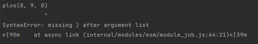
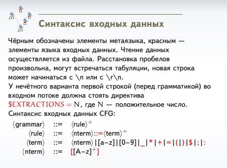

# Теоретическая часть
*Добиться того, чтобы сообщение о синтаксической ошибке в*
*программе на любом языке программирования,*
*использованном вами при выполнении лабораторных работ по*
*ТФЯ, указывало не на ту строчку, в которой ошибка*
*действительно есть. Описать в отчёте свои предположения, почему так произошло.*

````
const plus = (...args) => args.reduce((acc, v) => acc+v)
plus(1,2)
plus(3,4,5,
plus(8, 9, 0)
 ````


Если вместо ")" поставить ",", ошибка всплывет только после вызова следующей функции, создания новой функции или перед 
конструкциями "if", "for", "do", "while", "const", "let" и тд.
Так происходит из-за того, что функция в js может принимать бесконечное количество значений, а также все есть объект, значит,
передать можно также и результат вызова другой функции или просто функцию, проинициализировав ее.

# Практическая часть
*Автолекс*

1. Найти в данной грамматике все заведомо регулярные
   нетерминалы.
   
2. Все терминалы в правых частях правил, определяющих
   прочие нетерминалы, обернуть в охранные нетерминалы и
   также объявить регулярными (с конечным языком).
   
3. Для каждого регулярного нетерминала T найти
   PRECEDE(T) и FOLLOW(T). Если ни один терминал из
   множества PRECEDE(T)∪FOLLOW(T) не входит в язык
   нетерминала T, объявить нетерминал T токеном, иначе
   объявить о конфликте языков.
   
4. Для каждого токена породить регулярное выражение,
   которое его распознаёт.
## Входные данные


## Поиск заведомо регулярных нетерминалов.
Для начала построим словарь в котором каждому нетерминалу соответствует список нетерминалов. 
Если нетерминал A есть в правой части хотя бы одного правила, определяющего нетерминал B, то B входит в список соответствующий A.

Теперь строим множества правых и левых регулярных нетерминалов. Для правых и левых отдельно пометим нерегулярные нетерминалы, 
то есть такие, которые имеют хотя бы одно правило, не имеющее вид A -> bB (A -> Bb) или A -> B или A -> a. Для каждого такого нетерминала 
соответствующие ему нетерминалы из словаря помечаем нерегулярными и тд до тех пор, пока все нерегулярные нетерминалы не будут помечены

Оставшиеся нетерминалы являются правыми или левыми нерегулярными.

Рекурсивно замыкаем множество регулярных нетерминалов. Если при переписывании
нетерминала B все правые части содержат только регулярные нетерминалы, он регулярен и попадает в группу Closure.

## Поиск множеств PRECEDE и FOLLOW

FIRST(A)={c∣A⇒∗cβ}∪{ε if A⇒∗ε}

FOLLOW(A)={c∣S⇒∗αAcβ}∪{$ if S⇒∗αA}

Язык множеств LAST и PRECEDE — язык терминалов плюс (в случае
PRECEDE) специальный символ ˆ начала строки.
Определения и алгоритмы для нахождения LAST(A) и
PRECEDE(A) полностью аналогичны таковым для FIRST
и FOLLOW, с той разницей, что ищется последний, а не
первый, порождающийся A терминал, и возможные
предшествующие A (а не следующие за A) терминалы
языка.

Алгоритм построения FIRST и FOLLOW взят [отсюда](https://neerc.ifmo.ru/wiki/index.php?title=%D0%9F%D0%BE%D1%81%D1%82%D1%80%D0%BE%D0%B5%D0%BD%D0%B8%D0%B5_FIRST_%D0%B8_FOLLOW)

## Поиск токенов

Чтобы понять, принадлежит ли терминал языку, переберем все правила длины 1 (так как эпсилон правил нет, а терминал это слово длины 1,
остальными правилами порождаются более длинные слова), если правило состоит из нетерминала, также переберем и все порождающие его правила и тд

## Построение регулярных выражений 

Важный момент: регулярные выражения нужно строить не только для токенов, а для всех регулярных нетерминалов, 
иначе при построении регулярок для нетерминалов из замыкания возникнут проблемы.
### Преобразование в праволинейную грамматику

Функция преобразования принимает на вход стартовый нетерминал грамматики, то есть наш токен, а затем перестраивает правила 
для нетерминалов в порядке очереди.

Если правила для нетерминала уже перестроены, пропускаем его.
Если нет, то:
- Правила вида A -> C меняем на C -> A.
- Правила вида A -> a меняем на правило R* -> aA, где [R*] - дополнительный нетерминал, одинаковый для всей грамматики.
Если A - стартовый, добавляем еще и A* -> a
- Правила вида A -> Ca меняем на C -> aA, а если A - стартовый нетерминал, то добавляем С -> a. 
- Каждый нетерминал из правил добавляем в очередь, если его там нет.
### Порождение регулярного выражения

Сперва помечаем все не порождающие нетерминалы. Нетерминал порождающий, если есть хотя бы одно правило вида A -> a или 
если есть хотя бы одно правило, состоящее из терминалов и не порождающих нетерминалов. Находим все порождающие нетерминалы,
повторяя проверку для каждого нетерминала до тех пор пока есть изменения.

Для нетерминалов из множества праворегулярных преобразовываем грамматику к нужному виду для функции из второй лабораторной и 
строим регулярное выражение.

Для нетерминалов из множества леворегулярных строим праворегулярную грамматику уже в нужном виде.

Для нетерминалов из пересечения через "или" и конкатенацию строим регулярное выражение из других регулярных выражений.
